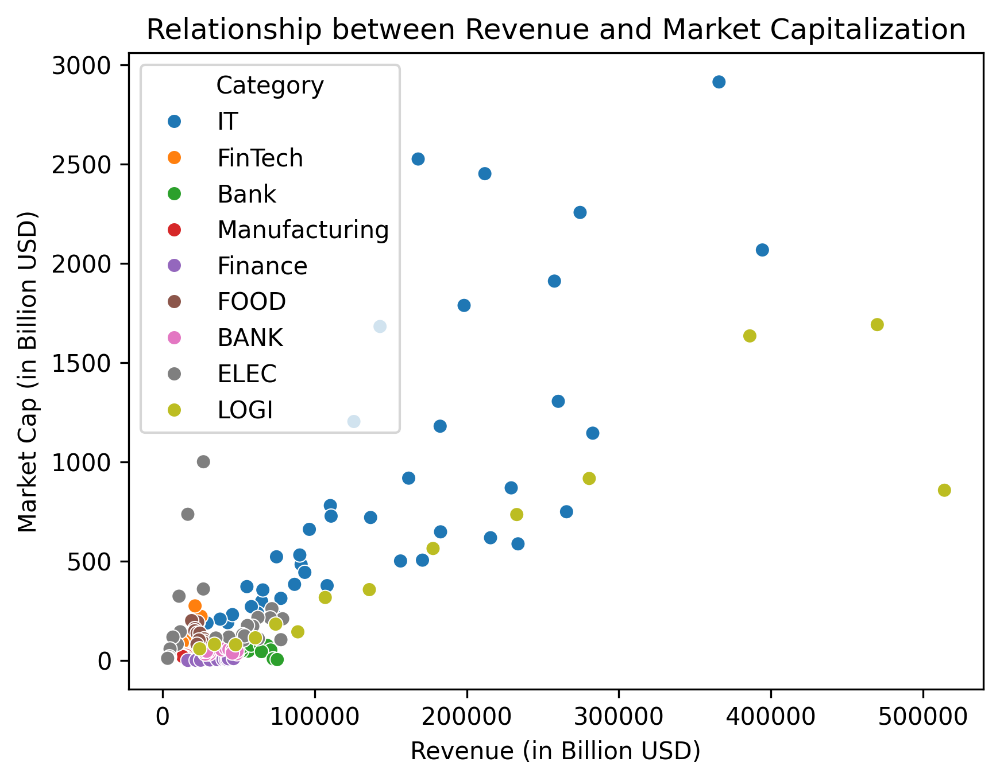
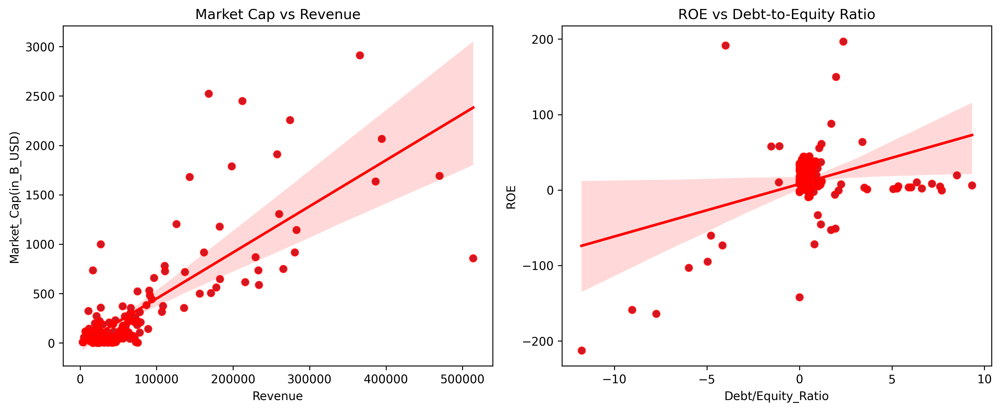
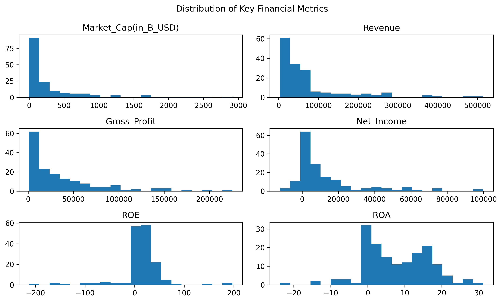
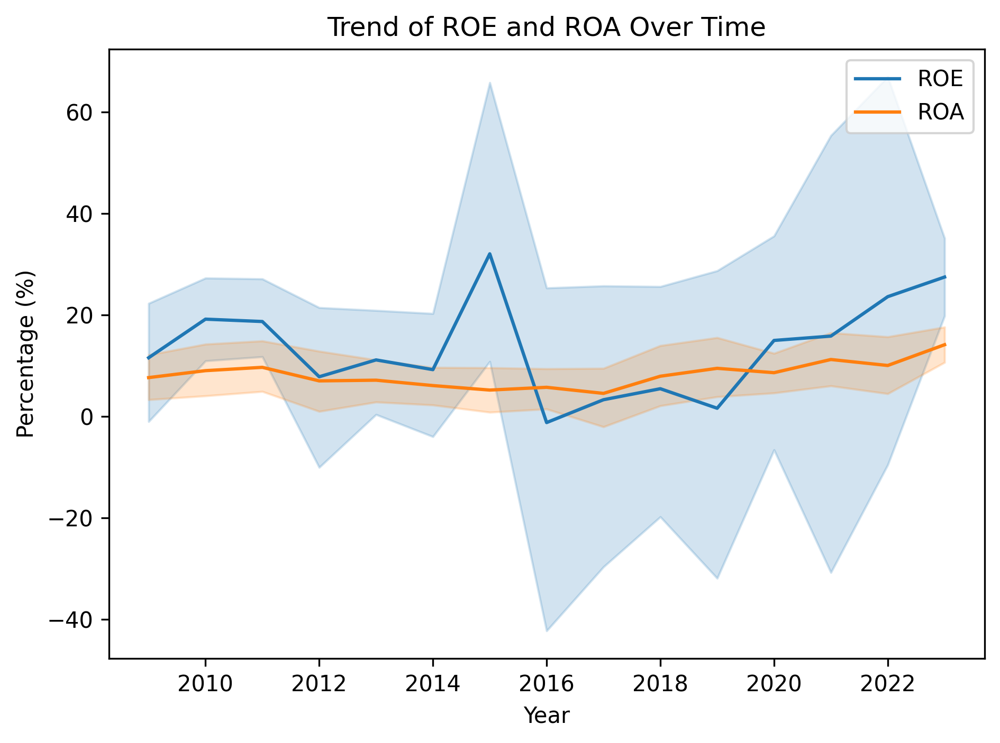

# Financial Performance Analysis of a Sample Global Company Portfolio

(Business-focused Financial Analysis & Decision Support)

## 1. Business Context
This project simulates a financial analysis assignment for a sample portfolio of global companies across multiple industries.

**Business problem:** Senior management wants to understand whether company size truly leads to better financial performance, and how capital structure, industry characteristics, and macroeconomic factors (inflation) affect profitability and risk.

The analysis is designed as a decision-support report, similar to what a Financial / Business Analyst would deliver to executives or investment stakeholders.

## 2. Key Business Questions

- Do larger companies generate higher returns, or just higher revenue?
- Which industries deliver sustainable profitability versus leveraged returns?
- How does capital structure (Debt/Equity) impact ROE volatility?
- Are productivity gains (revenue per employee) concentrated in specific sectors?
- How resilient are profitability metrics under inflationary pressure?

## 3. Key Findings & Insights
### 3.1 Company size ≠ profitability

- Revenue and Market Capitalization are positively correlated.
- However, higher revenue does not guarantee stronger ROE or ROA.
- IT and Logistics firms command high market caps relative to revenue, indicating growth expectations rather than current profitability.

**Insight:**

Investors reward scalability and future growth more than current income alone.

### 3.2 Leverage amplifies returns — and risk

- Firms with moderate leverage achieve higher ROE.
- Excessive Debt/Equity leads to volatile and unstable equity returns.
- Banking firms exhibit structurally high leverage, increasing systemic risk.

**Insight:**

ROE improvement driven purely by leverage is fragile and highly sensitive to market shocks.

### 3.3 Profitability is highly skewed across firms

- A small group of firms dominates revenue and profit.
- ROE and ROA distributions are wide, reflecting uneven operational efficiency.
- Most companies operate within a narrow margin range, limiting downside buffers.

**Insight:**

Industry structure matters more than firm count — profitability is not evenly distributed.

### 3.4 Industry-level performance differences

| Industry    | ROE    | ROA   | Debt/Equity | Business Interpretation                 |
| ----------- | ------ | ----- | ----------- | --------------------------------------- |
| IT          | 36.8%  | 15.7% | 0.42        | High-margin, scalable, capital-light    |
| FinTech     | 12.7%  | 4.3%  | 0.22        | Growth-oriented, conservative leverage  |
| Electronics | 19.5%  | 12.2% | 0.26        | Balanced operational efficiency         |
| Food        | -42.2% | 14.3% | -2.83       | High liabilities distort equity returns |
| Finance     | 16.7%  | -7.7% | -0.30       | Profit driven by financial leverage     |
| Banking     | 5.0%   | 0.24% | 6.29        | Highly leveraged, structurally risky    |

**Insight:**

Tech sectors outperform due to scalability and productivity, not asset intensity.

### 3.5 Productivity drives long-term advantage

- IT and FinTech firms generate significantly higher revenue per employee.
- Asset-heavy industries require more capital to scale returns.
- Stable ROA trends indicate operational consistency, even under inflation.

**Insight:**

Workforce efficiency is a stronger long-term driver than balance sheet expansion.

## 4. Business Recommendations
1. Avoid evaluating firms by size alone
    → Prioritize ROA, capital efficiency, and revenue per employee.

2. Target industries with scalable operating models
    → IT and FinTech offer superior risk-adjusted returns.

3. Monitor leverage-driven ROE carefully
    → High ROE without operational efficiency signals fragility.

4. Incorporate productivity metrics into performance reviews
    → Revenue per employee highlights sustainable competitive advantage.

    
## 5. Why This Analytical Approach

- Financial ratios were selected to separate operational performance from financial engineering.
- Industry segmentation reveals structural differences, not short-term noise.
- Trend analysis highlights resilience under macroeconomic pressure.
- This approach mirrors how analysts support investment decisions, capital allocation, and strategic planning.

## 6. Skills & Tools (Brief)

- Financial ratio analysis & business interpretation
- Exploratory analysis & executive-level storytelling
- Python (pandas, matplotlib) for analysis and visualization

(Technical implementation details are available in project files.)

## Author

Trinh Nguyen

📧 Contact: ng.trinh3023@gmail.com
📍 GitHub: [https://trinhnguyen-venus.github.io/](https://trinhnguyen-venus.github.io/)
